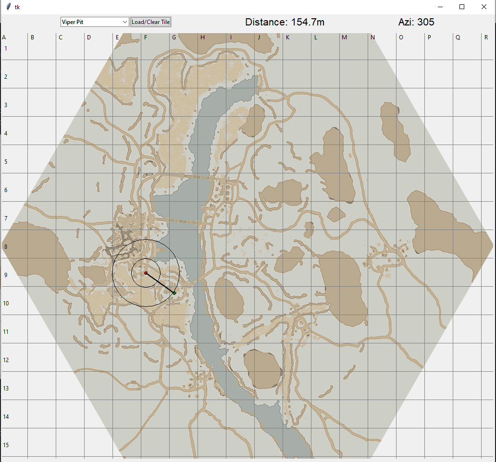

# Foxhole-NoSpotterArty

##### An artillery calculator for the game Foxhole which allows artillery operators to select targets based on map intelligence only (No spotter required).

You may have to run `python setup.py install` to install pygubu and tkinter before running `python main.py`

---
### Instructions

Load the area you are in then left click to select your location, right click to select your target.
Distance and azimuth to to target will be displayed when both positions are set. (Example shown below)

---
### Notes
* Expect a small degree of inaccuracy as the map scale has been determined through trial and error for the time being.
* Assets used from - https://github.com/clapfoot/warapi
